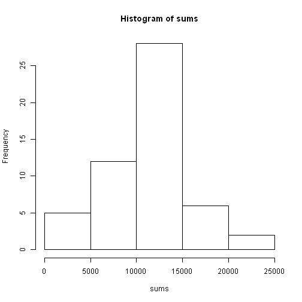
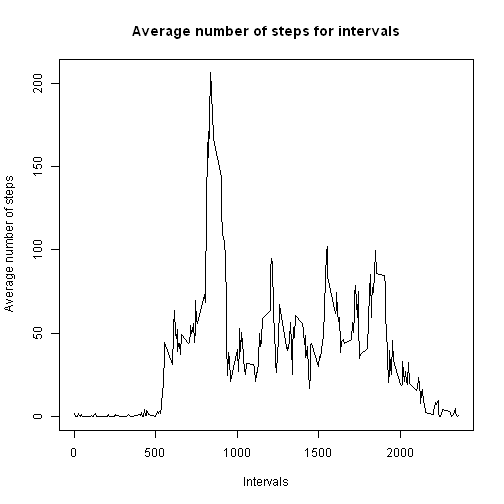
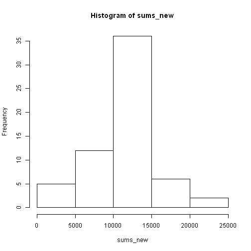
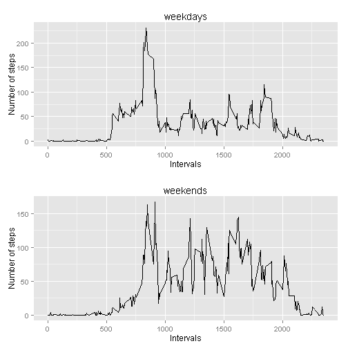

### Loading and preprocessing the data

First, we need to format output.


```r
library(knitr)
inline_hook <- function (x) {
  if (is.numeric(x)) {
    # ifelse does a vectorized comparison
    # If integer, print without decimal; otherwise print two places
    res <- ifelse(x == round(x),
      sprintf("%d", x),
      sprintf("%.2f", x)
    )
    paste(res, collapse = ", ")
  }
}
knit_hooks$set(inline = inline_hook)
```

Then we download the data.


```r
temp <- tempfile()
download.file("http://d396qusza40orc.cloudfront.net/repdata%2Fdata%2Factivity.zip",temp)
unzip(temp)
data <- read.csv("activity.csv")
unlink(temp)

data$date <- as.Date(as.character(data$date))
data$steps <- as.numeric(as.character(data$steps))
```


### What is mean total number of steps taken per day?

After loading the data and ensuring its correct format we get total sums of steps for each day.


```r
dfs <- split(data, f=data[, "date"])
sums <- sapply(dfs, function(x) sum(x$steps))
```

The histogram of the total number of steps taken each day:


```r
hist(sums)
```

 

We can now calculate the mean and the median total number of steps taken per day.


```r
mean_total_steps <- mean(sums, na.rm= TRUE)
median_total_steps <- median(sums, na.rm= TRUE)
```

The mean total number of steps taken per day is 10766.19.

The median total number of steps taken per day is 10765.

### What is the average daily activity pattern?


```r
dfs2 <- split(data, f=data[, "interval"])
steps_per_interval <- sapply(dfs2, function(x) mean(x$steps, na.rm= TRUE))
intervals <- sapply(dfs2, function(x) x$interval[1])
```

Time series plot of the 5-minute interval (x-axis) and the average number of steps taken, averaged across all days (y-axis):


```r
plot(intervals, steps_per_interval, type="l", 
     main="Average number of steps for intervals", 
     xlab="Intervals", ylab="Average number of steps")
```

 

Let's find a 5-minute interval, on average across all the days in the dataset, 
that contains the maximum number of steps.


```r
max_pos <- match(max(steps_per_interval), steps_per_interval)
max_int <- intervals[max_pos]
```

The interval is 835.

### Inputting missing values

There are a number of days/intervals where there are missing values 
(coded as NA). The presence of missing days may introduce bias into some 
calculations or summaries of the data.


```r
num_rows_with_nas <- sum(is.na(data$steps))
```

The total number of missing values in the dataset (i.e. the total number of rows with NAs): 2304.

Now we fill in all of the missing values in the dataset. We use the mean for that 5-minute interval. A new dataset is created in the result.


```r
data2 <- data.frame()

i <- 1

for (step in data$steps){
    if (is.na(step)) {
        
        int <- data$interval[i]
        place <- match(int, intervals)
        avg <- steps_per_interval[place]
        
        data2 <- rbind(data2, data.frame(steps = avg, 
                                   date = data$date[i], 
                                   interval = data$interval[i])
                      )
    } else {
        data2 <- rbind(data2, data.frame(steps = data$step[i], 
                                   date = data$date[i], 
                                   interval = data$interval[i])
                      )
    }
    i <- i+1
}
```


A histogram of the total number of steps taken each day: 


```r
dfs_new <- split(data2, f=data2[, "date"])

sums_new <- sapply(dfs_new, function(x) sum(x$steps))

mean_total_steps2 <- mean(sums_new)
median_total_steps2 <- median(sums_new)

hist(sums_new)
```

 

The mean total number of steps taken per day is 10766.19.

The median total number of steps taken per day is 10766.19.

As we can see,  the mean does not differ from the estimate from the first part of the assignment, while the median does.

So the impact of inputting missing data on the estimates of the total daily 
number of steps is the following:

* It changes the median (which is quite natural, as more observations count now), but doesn't change the mean.
* It makes the mean and median equal, thus making the distribution closer to normal.
* It makes the absolute figures of frquencies higher, as can be seen from the plots.

### Are there differences in activity patterns between weekdays and weekends?

We create a new factor variable in the dataset with two levels – “weekday” and 
“weekend” indicating whether a given date is a weekday or weekend day.


```r
data2 <- cbind(data2, data.frame(is_weekend=''))

Sys.setlocale("LC_TIME", "English")
```

```
## [1] "English_United States.1252"
```

```r
data2$is_weekend <- sapply(data2$date, function (x) {
    if ((weekdays(x) != 'Saturday') & (weekdays(x) != 'Sunday')) {
        'weekday'
    } else {
        'weekend'
    }
})
```

A panel plot containing a time series plot of the  5-minute interval (x-axis) and the average number of steps taken, averaged across all weekday days or weekend days (y-axis):
 

```r
library(ggplot2)

weekdays <- data2[data2$is_weekend=='weekday',]
weekends <- data2[data2$is_weekend=='weekend',]

dfs2_weekdays <- split(weekdays, f=weekdays[, "interval"])
dfs2_weekends <- split(weekends, f=weekends[, "interval"])

steps_per_interval_weekdays <- sapply(dfs2_weekdays, function(x) mean(x$steps))
steps_per_interval_weekends <- sapply(dfs2_weekends, function(x) mean(x$steps))

intervals_weekdays <- sapply(dfs2_weekdays, function(x) x$interval[1])
intervals_weekends <- sapply(dfs2_weekends, function(x) x$interval[1])

plot1 <- qplot(intervals_weekdays, steps_per_interval_weekdays, geom="path", 
               main="weekdays", xlab="Intervals", ylab="Number of steps")
plot2 <- qplot(intervals_weekends, steps_per_interval_weekends, geom="path", 
               main="weekends", xlab="Intervals", ylab="Number of steps")

# Define grid layout to locate plots and print both graphs
pushViewport(viewport(layout = grid.layout(2, 1)))
print(plot1, vp = viewport(layout.pos.row = 1, layout.pos.col = 1))
print(plot2, vp = viewport(layout.pos.row = 2, layout.pos.col = 1))
```

 
